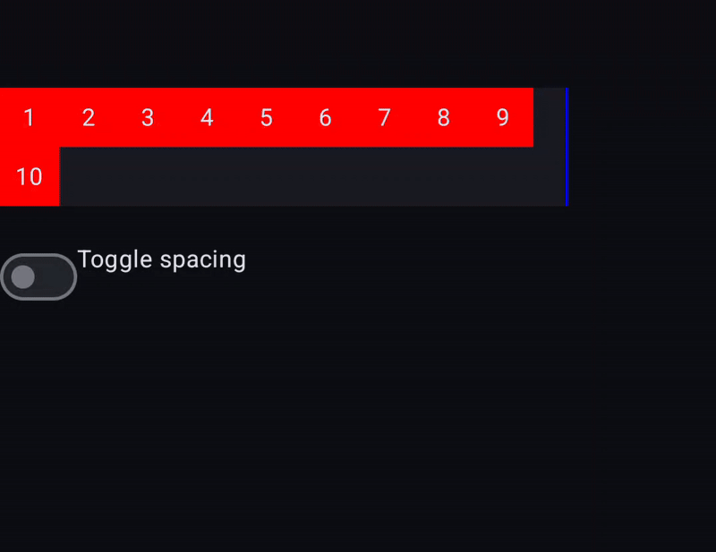

FlowRow is used to display `10` children with `IntristicSize.Min` on the parent used to display a properly sized divider. Everything works correctly as long as FlowRow does not have any spacing set. Once it does, it stops showing some last elements. Observe the following recording:

